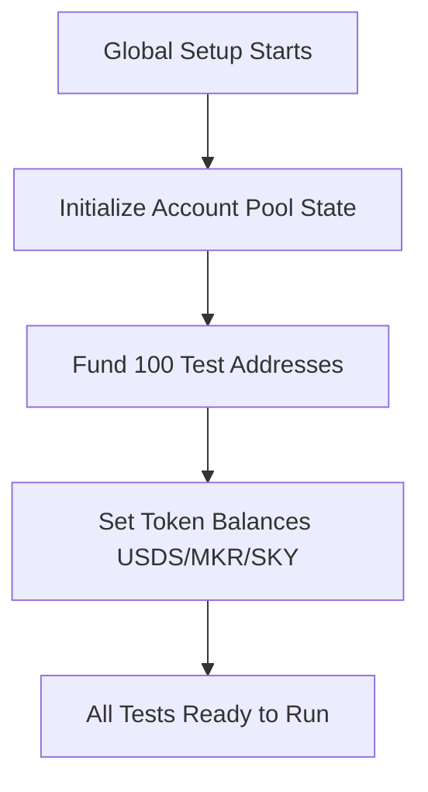

# Parallel E2E Testing Architecture

This document describes the complete architecture and flow of the parallel E2E testing system implemented for the Tarmac DeFi application.

## Overview

The parallel testing system allows multiple E2E tests to run simultaneously without interfering with each other by ensuring complete test isolation through unique test accounts and atomic account management.

## Core Components

### 1. Account Pool Management (`accountPoolManager.ts`)

**Purpose**: Manages a pool of 100 unique test accounts to ensure no two tests ever share the same account.

**Key Features**:

- **Atomic Account Claiming**: Uses file-system locks to ensure thread-safe account assignment
- **No Account Release**: Once claimed, accounts are never released to prevent reuse
- **Worker-based Distribution**: Each Playwright worker gets its own unique account

```typescript
// Core account claiming logic
export async function claimAccount(): Promise<`0x${string}`> {
  const lockFilePath = path.join(os.tmpdir(), 'account-pool.lock');
  return await withFileLock(lockFilePath, async () => {
    // Atomic account selection and claiming
  });
}
```

### 2. Test Account Pool (`testWallets.ts`)

**Purpose**: Contains 100 pre-generated Ethereum addresses for test isolation.

```typescript
export const TEST_WALLET_ADDRESSES: readonly `0x${string}`[] = [
  '0x742d35Cc6bF4432c41fCC4A7c1dD25dDe88F6ad8', // 0
  '0xC0ffEE0000000000000000000000000000000000' // 1
  // ... 98 more addresses
];
export const TEST_WALLET_COUNT = 100;
```

### 3. Global Setup (`global-setup-parallel.ts`)

**Purpose**: Funds all 100 test accounts before any tests run.

**Process**:

1. Initialize account pool state file
2. Fund all 100 addresses with test tokens on multiple networks
3. Set up initial balances for USDS, MKR, SKY tokens
4. Log funding completion for verification

### 4. Wagmi Configuration (`config.e2e.parallel.ts`)

**Purpose**: Creates mock wallet connectors that use test accounts.

**Key Features**:

- **Lazy Account Resolution**: Accounts are resolved only when needed
- **Worker-specific Injection**: Each worker gets its unique account
- **Mock Wallet Simulation**: Simulates real wallet behavior without requiring actual wallets

```typescript
// Lazy account resolution
async getAccounts() {
  const accounts = getWorkerAccount();
  return accounts;
}
```

### 5. Test Fixtures (`fixtures-parallel.ts`)

**Purpose**: Provides isolated browser contexts and test accounts to each test.

**Features**:

- **Account Claiming**: Each test gets a unique account from the pool
- **Browser Context Injection**: Injects test account into browser context
- **No Account Release**: Accounts are never returned to the pool

```typescript
export const test = baseTest.extend<{
  isolatedPage: Page;
  testAccount: `0x${string}`;
}>({
  testAccount: async ({}, use, testInfo) => {
    const account = await claimAccount();
    console.log(`🔒 Worker ${testInfo.workerIndex} claimed account:`, account);
    await use(account);
    // NO RELEASE - account stays claimed
  }
});
```

### 6. Helper Utilities

#### Account Initialization (`initializeTestAccount.ts`)

- **Purpose**: Initializes fresh accounts with blockchain activity
- **Method**: Sends 1 wei self-transfer to activate account
- **Usage**: Opt-in per test when balance updates are critical

#### Balance Parsing (`helper functions in test files`)

- **Purpose**: Consistent balance parsing across all tests
- **Functions**:
  - `parseBalanceText()`: Strips currency symbols and commas
  - `getSupplyInputBalance()`: Gets supply input balance
  - `getSuppliedBalance()`: Gets current supplied balance
  - `getWithdrawInputBalance()`: Gets withdraw input balance

## Architecture Flow

### 1. Test Suite Initialization



### 2. Individual Test Execution


### 3. Account Pool State Management


## Configuration Files

### 1. Playwright Config (`playwright-parallel.config.ts`)

```typescript
export default defineConfig({
  fullyParallel: true,
  workers: 6, // Configurable parallelism
  retries: 2, // Auto-retry failed tests
  globalSetup: './src/test/e2e/global-setup-parallel.ts',
  reporter: [
    ['html', { open: 'never' }],
    ['line'],
    ['json', { outputFile: 'test-results.json' }] // For retry tracking
  ]
});
```

### 2. Package.json Scripts

```json
{
  "e2e:parallel": "playwright test --config playwright-parallel.config.ts",
  "e2e:parallel:retry-failed": "SKIP_FUNDING=true playwright test --last-failed --config playwright-parallel.config.ts",
  "e2e:parallel:retry-serial": "SKIP_FUNDING=true playwright test --last-failed --workers=1 --config playwright-parallel.config.ts"
}
```

## Test Isolation Strategy

### 1. Account-Level Isolation

- **100 Unique Addresses**: No two tests ever share an account
- **Pre-funded Balances**: All accounts have sufficient test tokens
- **Permanent Claiming**: Once used, accounts are never reused

### 2. Browser-Level Isolation

- **Isolated Contexts**: Each test gets a fresh browser context
- **Mock Wallet Injection**: Test accounts are injected at the browser level
- **No Cross-Test Pollution**: Tests cannot affect each other's state

### 3. Network-Level Isolation

- **Tenderly Forks**: Each network uses isolated blockchain forks
- **Consistent State**: All tests start with the same blockchain state
- **Independent Transactions**: Test transactions don't interfere

## Retry Mechanism

### 1. Automatic Retries

- **Built-in**: 2 retries per test configured in Playwright
- **Same Account**: Retries use the same claimed account
- **Fresh Context**: New browser context for each retry

### 2. Manual Retry System

- **Failed Test Tracking**: JSON reporter tracks which tests failed
- **Selective Re-run**: `--last-failed` flag runs only failed tests
- **Skip Funding**: Retry scripts use `SKIP_FUNDING=true` for speed

### 3. Retry Strategies

```bash
# Retry failed tests in parallel
pnpm e2e:parallel:retry-failed

# Retry failed tests serially (more stable)
pnpm e2e:parallel:retry-serial

# Automated retry with wrapper script
./run-tests-with-retry.sh
```

## Performance Optimizations

### 1. Funding Optimization

- **Batch Operations**: Fund all accounts in parallel during setup
- **Skip on Retry**: Retry scripts skip funding for speed
- **Network-Specific**: Only fund networks being tested

### 2. Account Management

- **Lock-Free Reading**: Most operations don't require locks
- **Minimal State**: Only track claimed status, not detailed usage
- **File-System Based**: No external dependencies or services

### 3. Test Execution

- **Full Parallelism**: `fullyParallel: true` enables maximum concurrency
- **Configurable Workers**: Can adjust based on system resources
- **Smart Retries**: Only retry tests that actually failed

## Troubleshooting

### 1. Common Issues

**Account Pool Exhaustion**:

- **Symptom**: "No available accounts" error
- **Solution**: Increase `TEST_WALLET_COUNT` or reduce parallel workers
- **Prevention**: Monitor account usage in logs

**Balance Update Issues**:

- **Symptom**: Tests fail because balances don't update
- **Solution**: Use `initializeTestAccount()` helper in test
- **Root Cause**: Fresh accounts need blockchain activity

**Lock Contention**:

- **Symptom**: Tests timeout during account claiming
- **Solution**: Check for zombie lock files in `/tmp`
- **Prevention**: Automatic cleanup on process exit

### 2. Debugging Commands

```bash

# Run with verbose output
pnpm playwright test --config playwright-parallel.config.ts --verbose

# Check account pool state
cat /tmp/account-pool-state.json
```

## Monitoring and Observability

### 1. Logging Strategy

- **Account Claiming**: Log which worker claims which account
- **Balance Tracking**: Log initial and final balances in critical tests
- **Funding Status**: Log completion of account funding
- **Error Context**: Include account info in error messages

### 2. Test Reporting

- **HTML Report**: Visual test results with traces
- **JSON Output**: Machine-readable results for CI/CD
- **Line Reporter**: Real-time progress during execution

## Future Improvements

### 1. Potential Enhancements

- **Dynamic Pool Sizing**: Auto-adjust pool size based on test count
- **Account Health Checks**: Verify account balances before claiming
- **Distributed Testing**: Support multiple test runners sharing pool
- **Advanced Retry Logic**: Smart retry based on failure patterns

### 2. Scalability Considerations

- **Database Backend**: Replace file-based state with database for scale
- **Account Recycling**: Safe account reuse after test completion
- **Cross-Network Testing**: Unified account management across chains

## Conclusion

This parallel testing architecture provides:

✅ **Complete Test Isolation**: No test interference through unique accounts
✅ **High Performance**: 6x faster execution through parallelism
✅ **Reliability**: Robust retry mechanisms for flaky tests
✅ **Maintainability**: Clear separation of concerns and helper utilities
✅ **Scalability**: Easy to add more tests without account conflicts

The system successfully handles the complexities of parallel DeFi testing while maintaining test reliability and developer productivity.
